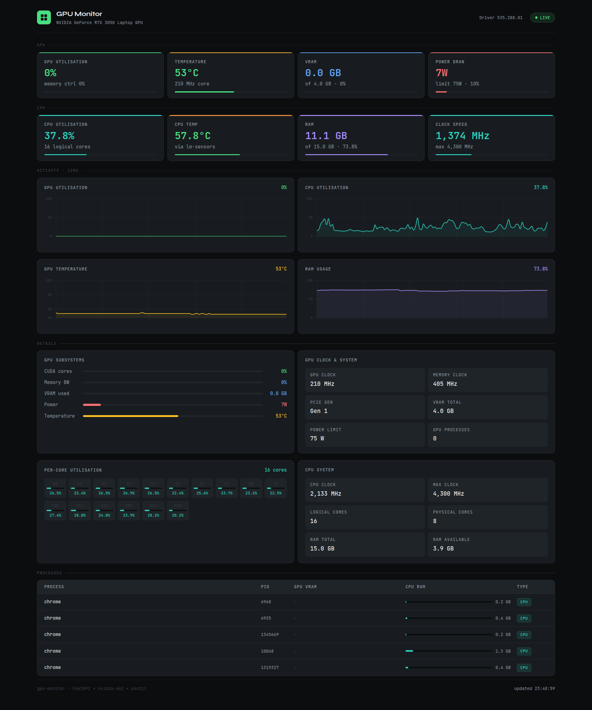

# GPU Monitor

A modern, real-time NVIDIA GPU dashboard for Ubuntu. Runs as a native desktop app — click the icon, browser opens, done. No Grafana, no Prometheus, no bloat.


## Dashboard



Live monitoring dashboard showing GPU and CPU utilisation, temperature, VRAM, RAM, per-core breakdown, and process table. Built with FastAPI + nvidia-smi + psutil.

## Features

- Live GPU utilisation chart — 120 second rolling window
- Temperature chart — 120 second rolling window
- VRAM usage with per-process breakdown
- Power draw vs TDP limit
- Subsystem bars — CUDA, memory bandwidth, encoder, decoder, fan
- Clock speeds — GPU core and memory
- PCIe generation and driver version
- All running compute processes with VRAM share
- Demo mode — works without a GPU for testing

## Requirements

- Ubuntu 20.04 or later
- Python 3.9+
- NVIDIA GPU with drivers installed (`nvidia-smi` in PATH)

## Desktop app install (recommended)

One command sets everything up — creates a venv, installs dependencies, registers the icon and app menu entry, and drops a shortcut on your Desktop.

```bash
git clone https://github.com/RlNZLER/gpu-dashboard.git
cd gpu-dashboard
bash install.sh
```

After that, launch it from your Desktop icon or search **GPU Monitor** in your app menu.

## Manual / headless usage

```bash
# Create and activate a venv
python3 -m venv venv
source venv/bin/activate

# Install dependencies
pip install -r requirements.txt

# Start the server
python app.py

# Open in browser
# http://localhost:8000
```

## How it works

```
nvidia-smi (1s poll)  →  FastAPI /api/metrics  →  Browser dashboard (Chart.js, 1.5s refresh)
```

`app.py` spawns `nvidia-smi` as a subprocess every second and keeps a 120-point rolling history for utilisation, temperature, memory, and power. The frontend is a single `dashboard.html` served directly by FastAPI — no build step, no npm.

`launch.sh` starts the server in the background, waits for it to be ready, then opens `http://localhost:8000` in your default browser. Re-launching kills any previous instance automatically, so no port conflicts.

## Project structure

```
gpu-dashboard/
├── app.py            # FastAPI backend — polls nvidia-smi, serves metrics JSON
├── dashboard.html    # Frontend — dark dashboard UI with live charts
├── launch.sh         # Desktop launcher script
├── install.sh        # One-time installer (venv + desktop entry + icon)
├── icon.png          # App icon
├── requirements.txt  # Python dependencies
└── README.md
```

## API

Single JSON endpoint — useful if you want to pipe metrics elsewhere.

```
GET /api/metrics
```

Response shape:

```json
{
  "latest": {
    "name": "NVIDIA RTX 4070 Ti",
    "util_gpu": 78,
    "temp": 71,
    "mem_used_mb": 9420,
    "mem_total_mb": 12288,
    "power_draw": 187.4,
    "power_limit": 285.0,
    "fan_speed": 62,
    "clock_gpu_mhz": 2535,
    "clock_mem_mhz": 10501,
    "processes": [...]
  },
  "history": {
    "util": [0, 12, 45, ...],
    "temp": [65, 66, 68, ...],
    "mem_util": [...],
    "power": [...]
  },
  "history_len": 120
}
```

## Uninstall

```bash
rm ~/.local/share/applications/gpu-monitor.desktop
rm ~/.local/share/icons/hicolor/256x256/apps/gpu-monitor.png
rm ~/Desktop/gpu-monitor.desktop   # if it exists
rm -rf venv/
```

## Multi-GPU

All GPUs are returned in `latest.gpus[]`. The dashboard currently displays GPU 0. PRs welcome.

